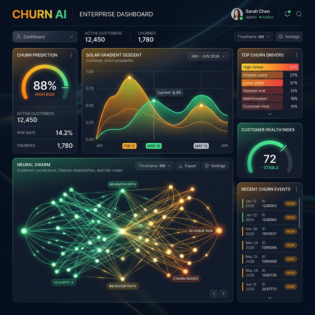

# 🌌 CHURN AI: The Strategic Intelligence Hub

**CHURN AI** is a state-of-the-art Autonomous Customer Retention system designed for the 2026 enterprise landscape. It doesn't just predict customer churn; it actively prevents it using a network of collaborative AI agents working in a "Swarm Intelligence" configuration.

---

## 🚀 Key Autonomous Agents

### 🧠 1. The Manager Agent (Executive reporting)
*   **Role**: Weekly Strategic Oversight.
*   **Operation**: Every Monday at 09:00 AM, the agent crawls the prediction database, renders a professional strategic infographic, and emails a detailed report to the CEO/Admin.
*   **Tech**: Node-cron, Gemini 2.0 Flash, Nodemailer.

### 🕸️ 2. The Retention Agent (Automated Outreach)
*   **Role**: Real-time Customer Preservation.
*   **Operation**: When a customer hits a high-risk threshold (≥70%), this agent automatically generates a hyper-personalized apology/retention email with dynamic offers (e.g., 20% discount) and sends it directly to the customer.
*   **Impact**: Zero-touch customer recovery.

### 🔄 3. The Self-Correction Agent (Learning Hub)
*   **Role**: Continuous Intelligence Optimization.
*   **Operation**: Closes the feedback loop by allowing human administrators to verify/correct AI predictions. Lessons learned are archived to refine future prediction prompts.
*   **Tech**: AI Learning Feedback Loop (Neon DB).

---

## 🎨 Professional Visual Suite
*   **Solaris Gradient Matrix**: Real-time training and loss visualization.
*   **Swarm Flow Visualization**: A futuristic agent-network diagram showing live communication between AI nodes.
*   **Intelligence Infographics**: Professional-grade data visualizations (Pictograms, Churn Drivers, Accuracy Charts).
*   **PRO Export**: One-click professional PDF report generation with AI summaries.

---

## 🛠️ Technology Stack

| Layer | Technology |
| :--- | :--- |
| **Logic Core** | Node.js, Express, TypeScript |
| **Intelligence** | Google Gemini 2.0 Flash, Groq SDK |
| **Database** | Neon PostgreSQL (Serverless) |
| **Frontend** | React 19, Vite, Tailwind CSS (Futuristic Dark Theme) |
| **Auth** | Google OAuth 2.0, JWT (JSON Web Tokens) |
| **Automation** | Node-cron, Nodemailer |
| **Deployment** | Docker (Hugging Face / Render), Vercel (Frontend) |

---

## ⚙️ Environment Variables (.env)

| Key | Description |
| :--- | :--- |
| `DATABASE_URL` | Neon PostgreSQL Connection String |
| `GEMINI_API_KEY` | Google Generative AI API Key |
| `GROQ_API_KEY` | Groq Cloud API Key |
| `SMTP_USER` | Gmail Address for Automation |
| `SMTP_PASS` | Google App Password (Safety First) |
| `ADMIN_EMAIL` | Destination for Weekly Reports |
| `JWT_SECRET` | Secret key for session encryption |
| `VITE_GOOGLE_CLIENT_ID` | Google OAuth Client ID |

---

## 📦 Installation & Deployment

### Local Setup
1. `npm install`
2. Configure `.env` from `.env.example`
3. `npm run dev`

### Backend Deployment (Hugging Face / Docker)
This project includes a production-ready `Dockerfile`.
1. Create a "Space" on Hugging Face (Docker SDK).
2. Connect your GitHub repository.
3. Configure the Secret Environment Variables on HF.

### Frontend Deployment (Vercel)
1. Import the project into Vercel.
2. Set `VITE_API_URL` to your Backend URL.
3. Set `VITE_GOOGLE_CLIENT_ID`.

---

## 🖥️ System Interface Preview

---

## ⚖️ Legal Notice
*Strategic actions generated by CHURN AI should be monitored by human oversight. The system uses advanced MPC (Multi-Party Computation) simulation logic.*

**Built by [Muhammad Usman Ray] with 🌌 Churn Intelligence Protocol.**
